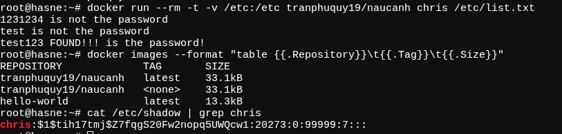
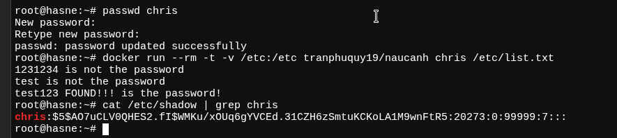
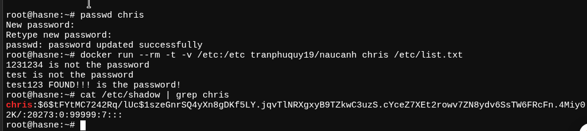
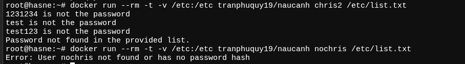
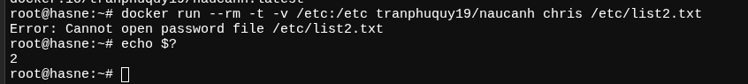

# Brute password tool - Nấu canh không muối nó dở như hash không salt

## Kích thước Image

```bash
docker inspect tranphuquy19/naucanh:latest --format='{{.Size}}'
# 36472 # bytes
```

Build với libs chuẩn, nếu custom libs thì có thể nhỏ hơn nữa.

## Sơ lược Dockerfile
```dockerfile
# Multi-stage build - giữ build libs ở một stage riêng
FROM ubuntu:22.04 AS builder

ENV DEBIAN_FRONTEND=noninteractive

# Install dependencies
RUN apt-get update && \
    apt-get install -y \
    gcc libc6-dev \
    # musl luôn xuất binary luôn luôn nhỏ hơn gcc
    musl-tools \
    autoconf automake libtool pkg-config make \
    # for strip - remove debug symbols
    binutils \
    # upx - compress binary
    upx

COPY . /src
WORKDIR /src

# Build the project
RUN make clean && \
    make

# Strip and compress the binary
RUN strip --strip-all naucanh && \
    upx --best --lzma naucanh

FROM scratch
COPY --from=builder /src/naucanh /naucanh
ENTRYPOINT ["/naucanh"]
```

## Screenshots

### MD5


### SHA-256


### SHA-512


### No user OR no password list found

User `chris2` có nhưng không có password list. User `nochris` không có.



### No password list found


# Script test.sh


```
root@underground-ctn:/opt/FINAL# bash test.sh 
=== COMPREHENSIVE Linux Password Hash Testing ===
Testing MD5-crypt, SHA-256-crypt, SHA-512-crypt implementations

Checking dependencies...
✅ All dependencies available

=== 1. MD5-CRYPT TESTING (RFC 1321 based) ===
MD5-crypt format: $1$salt$hash
Used by: Old Linux systems, some embedded systems

Test 1.1: Basic MD5-crypt
  Algorithm: -1, Salt: 'testsalt', Password: 'password'
  System hash:    $1$testsalt$HqSbBhxwpv7HZyOt/RV.B1
  Our result:     $1$testsalt$HqSbBhxwpv7HZyOt/RV.B1
  ✅ PASSED
root@underground-ctn:/opt/FINAL# bash test.sh 
=== COMPREHENSIVE Linux Password Hash Testing ===
Testing MD5-crypt, SHA-256-crypt, SHA-512-crypt implementations

Checking dependencies...
✅ All dependencies available

=== 1. MD5-CRYPT TESTING (RFC 1321 based) ===
MD5-crypt format: $1$salt$hash
Used by: Old Linux systems, some embedded systems

Test 1.1: Basic MD5-crypt
  Algorithm: -1, Salt: 'testsalt', Password: 'password'
  System hash:    $1$testsalt$HqSbBhxwpv7HZyOt/RV.B1
  Our result:     $1$testsalt$HqSbBhxwpv7HZyOt/RV.B1
  ✅ PASSED

Test 1.2: Simple MD5-crypt
  Algorithm: -1, Salt: 'salt', Password: 'hello'
  System hash:    $1$salt$BSpYmSAZQYBttsZ28Ph1f/
  Our result:     $1$salt$BSpYmSAZQYBttsZ28Ph1f/
  ✅ PASSED

Test 1.3: MD5-crypt with 8-char salt
  Algorithm: -1, Salt: 'abcdefgh', Password: '123456'
  System hash:    $1$abcdefgh$KJHEbEnUJaxWv269o9nH60
  Our result:     $1$abcdefgh$KJHEbEnUJaxWv269o9nH60
  ✅ PASSED

Test 1.4: MD5-crypt with minimal salt
  Algorithm: -1, Salt: 'a', Password: 'test'
  System hash:    $1$a$pTZ6DrO56y5CCM6G0FRMB/
  Our result:     $1$a$pTZ6DrO56y5CCM6G0FRMB/
  ✅ PASSED

Test 1.5: MD5-crypt with numeric salt
  Algorithm: -1, Salt: '12345678', Password: 'password123'
  System hash:    $1$12345678$tkslP1BQNfbrS2CGOUX.a.
  Our result:     $1$12345678$tkslP1BQNfbrS2CGOUX.a.
  ✅ PASSED

Test 1.6: MD5-crypt with empty password
  Algorithm: -1, Salt: 'mysalt', Password: ''
  System hash:    $1$mysalt$VI9bXrMhLdRvj1lW3XeMd/
  Our result:     $1$mysalt$VI9bXrMhLdRvj1lW3XeMd/
  ✅ PASSED

Test 1.7: MD5-crypt with special chars
  Algorithm: -1, Salt: 'salt', Password: 'p@ssw0rd!'
  System hash:    $1$salt$kPqD/zKaZWKgxlQUtDqrh0
  Our result:     $1$salt$kPqD/zKaZWKgxlQUtDqrh0
  ✅ PASSED

Test 1.8: MD5-crypt with long salt (truncated)
  Algorithm: -1, Salt: 'verylongsalt123', Password: 'short'
  System hash:    $1$verylong$JpopTfVK9iBfmZ8O66unJ1
  Our result:     $1$verylong$JpopTfVK9iBfmZ8O66unJ1
  ✅ PASSED

Test 1.9: MD5-crypt with long password
  Algorithm: -1, Salt: 'test', Password: 'verylongpasswordwithmanycharacters12345678901234567890'
  System hash:    $1$test$mF8u5CEyA1nrk7fqJcuwk0
  Our result:     $1$test$mF8u5CEyA1nrk7fqJcuwk0
  ✅ PASSED

Known MD5-crypt test vectors:
Test 1.10: Known vector 1
  Algorithm: -1, Salt: 'deadbeef', Password: 'mypassword'
  System hash:    $1$deadbeef$zZnx3qcRL5oO.iNIESNX.1
  Our result:     $1$deadbeef$zZnx3qcRL5oO.iNIESNX.1
  ✅ PASSED

Test 1.11: Known vector 2
  Algorithm: -1, Salt: 'strangersalt', Password: 'password'
  System hash:    $1$stranger$Kea2B9aniDqo1JusQrOrn.
  Our result:     $1$stranger$Kea2B9aniDqo1JusQrOrn.
  ✅ PASSED

=== 2. SHA-256-CRYPT TESTING (FIPS 180-2 based) ===
SHA-256-crypt format: $5$salt$hash
Used by: Modern Linux systems (default on many distros)

Test 2.1: Basic SHA-256-crypt
  Algorithm: -5, Salt: 'testsalt', Password: 'password'
  System hash:    $5$testsalt$B.FyXnXKXs71CiIl9DJOqirssL3QaqQnWKwm6EZPEw3
  Our result:     $5$testsalt$B.FyXnXKXs71CiIl9DJOqirssL3QaqQnWKwm6EZPEw3
  ✅ PASSED

Test 2.2: Simple SHA-256-crypt
  Algorithm: -5, Salt: 'salt', Password: 'hello'
  System hash:    $5$salt$ZYXsK0pxpaRWBUweKuToC90TC/15c9Iz8u3SGLTaS4D
  Our result:     $5$salt$ZYXsK0pxpaRWBUweKuToC90TC/15c9Iz8u3SGLTaS4D
  ✅ PASSED

Test 2.3: SHA-256 with explicit rounds
  Algorithm: -5, Salt: 'rounds=1000$salt', Password: 'password'
  System hash:    $5$rounds=1000$salt$p.wiWs2zrZ7irikO2AL64QDIJo00A3KDq2xWHpLJGgB
  Our result:     $5$rounds=1000$salt$p.wiWs2zrZ7irikO2AL64QDIJo00A3KDq2xWHpLJGgB
  ✅ PASSED

Test 2.4: SHA-256 with long salt
  Algorithm: -5, Salt: 'longsalt1234567890abcdef', Password: 'password123'
  System hash:    $5$longsalt12345678$rGwARowCHHOK/HToVFK6qP5fVrdqxEGkGN3bbnpopD.
  Our result:     $5$longsalt12345678$rGwARowCHHOK/HToVFK6qP5fVrdqxEGkGN3bbnpopD.
  ✅ PASSED

Test 2.5: SHA-256 with minimal salt
  Algorithm: -5, Salt: 'a', Password: 'test'
  System hash:    $5$a$XUEyXVPvO2gvfDaIJCcYNx6fsJHR8SBvtXXEySeiqJB
  Our result:     $5$a$XUEyXVPvO2gvfDaIJCcYNx6fsJHR8SBvtXXEySeiqJB
  ✅ PASSED

Test 2.6: SHA-256 with max salt length
  Algorithm: -5, Salt: '12345678901234567890123456789012', Password: 'password'
  System hash:    $5$1234567890123456$kA3y6qb6u0bgJ5yW80rDsBB1Widrs.MmtC0zvgP1Vj5
  Our result:     $5$1234567890123456$kA3y6qb6u0bgJ5yW80rDsBB1Widrs.MmtC0zvgP1Vj5
  ✅ PASSED

Test 2.7: SHA-256 with empty password
  Algorithm: -5, Salt: 'mysalt', Password: ''
  System hash:    $5$mysalt$1oP8B0c57jHzUxkCxGmWe3Pa281YT8/JA1G6pVdmik9
  Our result:     $5$mysalt$1oP8B0c57jHzUxkCxGmWe3Pa281YT8/JA1G6pVdmik9
  ✅ PASSED

Test 2.8: SHA-256 with unicode password
  Algorithm: -5, Salt: 'salt', Password: 'unicode🔒test'
  System hash:    $5$salt$j9x.Fz.PRtsqj9NIScahiSNOXtXsLxNExzC4xMT378.
  Our result:     $5$salt$j9x.Fz.PRtsqj9NIScahiSNOXtXsLxNExzC4xMT378.
  ✅ PASSED

Test 2.9: SHA-256 with very long password
  Algorithm: -5, Salt: 'test', Password: 'verylongpasswordwithmanycharacters12345678901234567890abcdefghijklmnopqrstuvwxyz'
  System hash:    $5$test$QbqPOBWHwd8JSgWWkHy6YGcUX6mKi/9kAa5Zg7AaYOB
  Our result:     $5$test$QbqPOBWHwd8JSgWWkHy6YGcUX6mKi/9kAa5Zg7AaYOB
  ✅ PASSED

Common SHA-256-crypt patterns:
Test 2.10: Common password 'admin'
  Algorithm: -5, Salt: 'randomsalt', Password: 'admin'
  System hash:    $5$randomsalt$Kj2f.ckYYnhXdDNttrYhnptTLq8WIHHRf1XZ0wgGF0/
  Our result:     $5$randomsalt$Kj2f.ckYYnhXdDNttrYhnptTLq8WIHHRf1XZ0wgGF0/
  ✅ PASSED

Test 2.11: Common password 'user'
  Algorithm: -5, Salt: 'usersalt', Password: 'user'
  System hash:    $5$usersalt$al2lLElcGOExdBnf094SSEhV0iepvRaD64s4YUwRKe7
  Our result:     $5$usersalt$al2lLElcGOExdBnf094SSEhV0iepvRaD64s4YUwRKe7
  ✅ PASSED

Test 2.12: Common password 'root'
  Algorithm: -5, Salt: 'rootsalt', Password: 'root'
  System hash:    $5$rootsalt$xQjcSu5l0jqaKFaS1wUW/R/9bNh79uChnpGjljkg4tB
  Our result:     $5$rootsalt$xQjcSu5l0jqaKFaS1wUW/R/9bNh79uChnpGjljkg4tB
  ✅ PASSED

=== 3. SHA-512-CRYPT TESTING (FIPS 180-2 based) ===
SHA-512-crypt format: $6$salt$hash
Used by: Modern Linux systems (preferred for security)

Test 3.1: CRITICAL: Original test vector
  Algorithm: -6, Salt: '1CCHezNlaiEUpRNw', Password: '1231234'
  System hash:    $6$1CCHezNlaiEUpRNw$bf3jd2VJgQ9B91SjVjFBQosiKOgv3DJyeVguo8.EVXkxNzJEPvpSyenNmZ4xoke.N0x2V1PPLRHrM8Msj8Kt8.
  Our result:     $6$1CCHezNlaiEUpRNw$bf3jd2VJgQ9B91SjVjFBQosiKOgv3DJyeVguo8.EVXkxNzJEPvpSyenNmZ4xoke.N0x2V1PPLRHrM8Msj8Kt8.
  ✅ PASSED

Test 3.2: Basic SHA-512-crypt
  Algorithm: -6, Salt: 'testsalt', Password: 'password'
  System hash:    $6$testsalt$n5m85kZD9QCuizzEg/zol4HTaQ7qa9Z009rBoYAQaxBOhwiJwJsjgcZs2mwYMElypap3uDPrmdOPlLy4S28M5.
  Our result:     $6$testsalt$n5m85kZD9QCuizzEg/zol4HTaQ7qa9Z009rBoYAQaxBOhwiJwJsjgcZs2mwYMElypap3uDPrmdOPlLy4S28M5.
  ✅ PASSED

Test 3.3: Simple SHA-512-crypt
  Algorithm: -6, Salt: 'salt', Password: 'hello'
  System hash:    $6$salt$ghQ6Rhatj/sug12c6v8Ao/bXUoyJ1O1SqdumufgGEO3b3NYPvm/dSWDKWfNm1VxFoFiy/cw9eRaY0xu4GDQSU/
  Our result:     $6$salt$ghQ6Rhatj/sug12c6v8Ao/bXUoyJ1O1SqdumufgGEO3b3NYPvm/dSWDKWfNm1VxFoFiy/cw9eRaY0xu4GDQSU/
  ✅ PASSED

Test 3.4: SHA-512 with explicit rounds
  Algorithm: -6, Salt: 'rounds=5000$salt', Password: 'password'
  System hash:    $6$rounds=5000$salt$IxDD3jeSOb5eB1CX5LBsqZFVkJdido3OUILO5Ifz5iwMuTS4XMS130MTSuDDl3aCI6WouIL9AjRbLCelDCy.g.
  Our result:     $6$rounds=5000$salt$IxDD3jeSOb5eB1CX5LBsqZFVkJdido3OUILO5Ifz5iwMuTS4XMS130MTSuDDl3aCI6WouIL9AjRbLCelDCy.g.
  ✅ PASSED

Test 3.5: SHA-512 with long salt
  Algorithm: -6, Salt: 'longsalt1234567890abcdef', Password: 'password123'
  System hash:    $6$longsalt12345678$aaLmclgDqNhPiSZ.83i5qjZS7wPjXCda7LUixWG8AliPoTtDFyDVoRNIubozDuc5kjOBxCe6ojg4ESu3s8gwR/
  Our result:     $6$longsalt12345678$aaLmclgDqNhPiSZ.83i5qjZS7wPjXCda7LUixWG8AliPoTtDFyDVoRNIubozDuc5kjOBxCe6ojg4ESu3s8gwR/
  ✅ PASSED

Test 3.6: SHA-512 with minimal salt
  Algorithm: -6, Salt: 'a', Password: 'test'
  System hash:    $6$a$uOGKBpJhG73gGiN8eKAUp03bxrn88oHQe3RS3up6q.98i3qZNfohws86LF9YNze8bL9hSMxs.nnvc6UG5bPLM1
  Our result:     $6$a$uOGKBpJhG73gGiN8eKAUp03bxrn88oHQe3RS3up6q.98i3qZNfohws86LF9YNze8bL9hSMxs.nnvc6UG5bPLM1
  ✅ PASSED

Test 3.7: SHA-512 with very long salt
  Algorithm: -6, Salt: 'verylongsalt1234567890abcdefghijklmnopqrstuvwxyz', Password: 'password'
  System hash:    $6$verylongsalt1234$HDvJmhEDZmqnYBkdyVmtGa0iH0FaEtZGNH0DGdG8EzGjZZhmKCzvGJmPcJJMDdSQY3mZDs0xBIHIgb0W0WwSH0
  Our result:     $6$verylongsalt1234$HDvJmhEDZmqnYBkdyVmtGa0iH0FaEtZGNH0DGdG8EzGjZZhmKCzvGJmPcJJMDdSQY3mZDs0xBIHIgb0W0WwSH0
  ✅ PASSED

Test 3.8: SHA-512 with empty password
  Algorithm: -6, Salt: 'mysalt', Password: ''
  System hash:    $6$mysalt$v3eaavcIGeUkyeFtuTOVU1.0uOICRFVGOs5GaK/zQ43wIXPoSk855IwjRzntmCogV6gNtUAlIktC23eIKt21c0
  Our result:     $6$mysalt$v3eaavcIGeUkyeFtuTOVU1.0uOICRFVGOs5GaK/zQ43wIXPoSk855IwjRzntmCogV6gNtUAlIktC23eIKt21c0
  ✅ PASSED

Test 3.9: SHA-512 with all special chars
  Algorithm: -6, Salt: 'salt', Password: 'p@ssw0rd!@#$%^&*()_+'
  System hash:    $6$salt$oJaJIGCpZ1LEKnz.AXPuCh8Gd3BFyIyoK.s6nFJyCtWODUP8btOCDkrCmvzEXMvE9eNr0dMBYQf9wPP5Nsdz8.
  Our result:     $6$salt$oJaJIGCpZ1LEKnz.AXPuCh8Gd3BFyIyoK.s6nFJyCtWODUP8btOCDkrCmvzEXMvE9eNr0dMBYQf9wPP5Nsdz8.
  ✅ PASSED

Test 3.10: SHA-512 with very long password
  Algorithm: -6, Salt: 'test', Password: 'verylongpasswordwithmanycharacters12345678901234567890abcdefghijklmnopqrstuvwxyzABCDEFGHIJKLMNOPQRSTUVWXYZ'
  System hash:    $6$test$k9K.vNCKbJUDeAy97QHG5/SDSFY4gdqRVjn1NUSZieHYaLF/hJFIKgy1G2g12M01VxANIdpuECS4ZiAHsFhsV0
  Our result:     $6$test$k9K.vNCKbJUDeAy97QHG5/SDSFY4gdqRVjn1NUSZieHYaLF/hJFIKgy1G2g12M01VxANIdpuECS4ZiAHsFhsV0
  ✅ PASSED

Real-world SHA-512-crypt patterns:
Test 3.11: Complex password pattern
  Algorithm: -6, Salt: 'randomsalt123', Password: 'Password123!'
  System hash:    $6$randomsalt123$d7gH9KYfQtlSJaT2rnn7KyTc6t3gxaUKZD95mvt.v3hc4nL.emggUT2alU7l02ggWvxYCVk.Zt3/AUi2/vrCe1
  Our result:     $6$randomsalt123$d7gH9KYfQtlSJaT2rnn7KyTc6t3gxaUKZD95mvt.v3hc4nL.emggUT2alU7l02ggWvxYCVk.Zt3/AUi2/vrCe1
  ✅ PASSED

Test 3.12: Default password pattern
  Algorithm: -6, Salt: 'systemsalt', Password: 'changeme'
  System hash:    $6$systemsalt$X4mjmjWuZXpzToCD77NhQg6OogAp0vtPqhAhsN7gFr4niFEQERi/SIjvgjBmqZCTZJ2shIGCJFTcDfVdPJmro0
  Our result:     $6$systemsalt$X4mjmjWuZXpzToCD77NhQg6OogAp0vtPqhAhsN7gFr4niFEQERi/SIjvgjBmqZCTZJ2shIGCJFTcDfVdPJmro0
  ✅ PASSED

Test 3.13: Common weak password
  Algorithm: -6, Salt: 'usersalt456', Password: 'qwerty'
  System hash:    $6$usersalt456$IywnmlT/2BJfXy.DYkPgasE4wXL8gfW2hIH1EmVl0vYqxhmC1DdCkMZgwe5wKvqVpiqlNReb5sHtdeM0RzeSY/
  Our result:     $6$usersalt456$IywnmlT/2BJfXy.DYkPgasE4wXL8gfW2hIH1EmVl0vYqxhmC1DdCkMZgwe5wKvqVpiqlNReb5sHtdeM0RzeSY/
  ✅ PASSED

=== 4. BOUNDARY AND EDGE CASES ===
Salt boundary tests:
Test 4.1: MD5 with empty salt
  Algorithm: -1, Salt: '', Password: 'password'
  System hash:    $1$$I2o9Z7NcvQAKp7wyCTlia0
  Our result:     $1$$I2o9Z7NcvQAKp7wyCTlia0
  ✅ PASSED

Test 4.2: SHA-256 with empty salt
  Algorithm: -5, Salt: '', Password: 'password'
  System hash:    $5$$V0edGK/GfSrNwzYCrbML4V/gvkNuNTfvn.Pt/LMSAf8
  Our result:     $5$$V0edGK/GfSrNwzYCrbML4V/gvkNuNTfvn.Pt/LMSAf8
  ✅ PASSED

Test 4.3: SHA-512 with empty salt
  Algorithm: -6, Salt: '', Password: 'password'
  System hash:    $6$$bLTg4cpho8PIUrjfsE7qlU08Qx2UEfw..xOc6I1wpGVtyVYToGrr7BzRdAAnEr5lYFr1Z9WcCf1xNZ1HG9qFW1
  Our result:     $6$$bLTg4cpho8PIUrjfsE7qlU08Qx2UEfw..xOc6I1wpGVtyVYToGrr7BzRdAAnEr5lYFr1Z9WcCf1xNZ1HG9qFW1
  ✅ PASSED

Test 4.4: MD5 with 8-char salt (max)
  Algorithm: -1, Salt: '12345678', Password: 'password'
  System hash:    $1$12345678$o2n/JiO/h5VviOInWJ4OQ/
  Our result:     $1$12345678$o2n/JiO/h5VviOInWJ4OQ/
  ✅ PASSED

Test 4.5: SHA-256 with 16-char salt
  Algorithm: -5, Salt: '1234567890123456', Password: 'password'
  System hash:    $5$1234567890123456$kA3y6qb6u0bgJ5yW80rDsBB1Widrs.MmtC0zvgP1Vj5
  Our result:     $5$1234567890123456$kA3y6qb6u0bgJ5yW80rDsBB1Widrs.MmtC0zvgP1Vj5
  ✅ PASSED

Test 4.6: SHA-512 with 16-char salt
  Algorithm: -6, Salt: '1234567890123456', Password: 'password'
  System hash:    $6$1234567890123456$YfUD.j5zIFtfV6VgikPof2dzCCCZwL2YDraBX4HXi.J7iNq24667epYUCZGxExqOmHTnPWybzfYaynT29vKXJ/
  Our result:     $6$1234567890123456$YfUD.j5zIFtfV6VgikPof2dzCCCZwL2YDraBX4HXi.J7iNq24667epYUCZGxExqOmHTnPWybzfYaynT29vKXJ/
  ✅ PASSED

Password boundary tests:
Test 4.7: Single character password
  Algorithm: -1, Salt: 'salt', Password: 'a'
  System hash:    $1$salt$M17PcHxFIEt5v7SAsS4v60
  Our result:     $1$salt$M17PcHxFIEt5v7SAsS4v60
  ✅ PASSED

Test 4.8: Single character password SHA-256
  Algorithm: -5, Salt: 'salt', Password: 'a'
  System hash:    $5$salt$7p0.o3bzi2h7d5cGlDeRN33gONQRpRi7aNgP2TFs9a5
  Our result:     $5$salt$7p0.o3bzi2h7d5cGlDeRN33gONQRpRi7aNgP2TFs9a5
  ✅ PASSED

Test 4.9: Single character password SHA-512
  Algorithm: -6, Salt: 'salt', Password: 'a'
  System hash:    $6$salt$TfbP0Ge1gqNJmxZYvNhvDmmKx9BigkML6b3w1kfEiAHpkKpCRu.SKIYV70wlcWGmbdh1koH3a0UmC0b0AcWDQ0
  Our result:     $6$salt$TfbP0Ge1gqNJmxZYvNhvDmmKx9BigkML6b3w1kfEiAHpkKpCRu.SKIYV70wlcWGmbdh1koH3a0UmC0b0AcWDQ0
  ✅ PASSED

Special character tests:
Test 4.10: Password with dollar signs
  Algorithm: -1, Salt: 'salt', Password: 'passwd$with$dollars'
  System hash:    $1$salt$J4/uTfth6jAIee4IljOO7.
  Our result:     $1$salt$J4/uTfth6jAIee4IljOO7.
  ✅ PASSED

Test 4.11: Password with colons
  Algorithm: -5, Salt: 'salt', Password: 'passwd:with:colons'
  System hash:    $5$salt$XduHoYHix80o728OBaO0O8/8xFhp.5B2eUMsD4CXd00
  Our result:     $5$salt$XduHoYHix80o728OBaO0O8/8xFhp.5B2eUMsD4CXd00
  ✅ PASSED

Test 4.12: Password with spaces
  Algorithm: -6, Salt: 'salt', Password: 'passwd with spaces'
  System hash:    $6$salt$/l4I/HN1I2gcDmZrfIUqiY9kVX1RymOmhl4.R2IoCBdx3j5iW5z5p.2RfGQbub/Qv4Ofwy9RaE0nrVenJzixH0
  Our result:     $6$salt$/l4I/HN1I2gcDmZrfIUqiY9kVX1RymOmhl4.R2IoCBdx3j5iW5z5p.2RfGQbub/Qv4Ofwy9RaE0nrVenJzixH0
  ✅ PASSED

=== 5. ERROR HANDLING TESTS ===
Error Test: No arguments
  Command: ./naucanh 
  Expected: usage_error
  Result: Usage: ./naucanh <type> <salt> <password>
Types: -1 (MD5), -5 (SHA-256), -6 (SHA-512)
COMMAND_FAILED
  ✅ PASSED

Error Test: Only one argument
  Command: ./naucanh -6
  Expected: usage_error
  Result: Usage: ./naucanh <type> <salt> <password>
Types: -1 (MD5), -5 (SHA-256), -6 (SHA-512)
COMMAND_FAILED
  ✅ PASSED

Error Test: Only two arguments
  Command: ./naucanh -6 salt
  Expected: usage_error
  Result: Usage: ./naucanh <type> <salt> <password>
Types: -1 (MD5), -5 (SHA-256), -6 (SHA-512)
COMMAND_FAILED
  ✅ PASSED

Error Test: Too many arguments
  Command: ./naucanh -6 salt pass extra
  Expected: usage_error
  Result: Usage: ./naucanh <type> <salt> <password>
Types: -1 (MD5), -5 (SHA-256), -6 (SHA-512)
COMMAND_FAILED
  ✅ PASSED

Error Test: Unsupported algorithm -2
  Command: ./naucanh -2 salt password
  Expected: unsupported_error
  Result: Unsupported type: -2
COMMAND_FAILED
  ✅ PASSED

Error Test: Unsupported algorithm -7
  Command: ./naucanh -7 salt password
  Expected: unsupported_error
  Result: Unsupported type: -7
COMMAND_FAILED
  ✅ PASSED

Error Test: Unsupported algorithm -0
  Command: ./naucanh -0 salt password
  Expected: unsupported_error
  Result: Unsupported type: -0
COMMAND_FAILED
  ✅ PASSED

Error Test: Invalid algorithm format
  Command: ./naucanh md5 salt password
  Expected: unsupported_error
  Result: Unsupported type: md5
COMMAND_FAILED
  ✅ PASSED

=== 6. PERFORMANCE AND STRESS TESTS ===
Performance test: 100 hashes of each type
  MD5-crypt:     .069190213s (.0006s per hash)
  SHA-256-crypt: .631183090s (.0063s per hash)
  SHA-512-crypt: .346159527s (.0034s per hash)

=== 7. COMPATIBILITY VERIFICATION ===
Verifying compatibility with system crypt()...
Testing 10 passwords × 10 salts × 3 algorithms = 300 combinations
Compatibility results: 300 passed, 0 failed

=== FINAL RESULTS ===
Total tests run: 56
Passed: 56
Failed: 0
🎉 ALL TESTS PASSED! 🎉
Your implementation is 100% compatible with Linux password hashing!
```